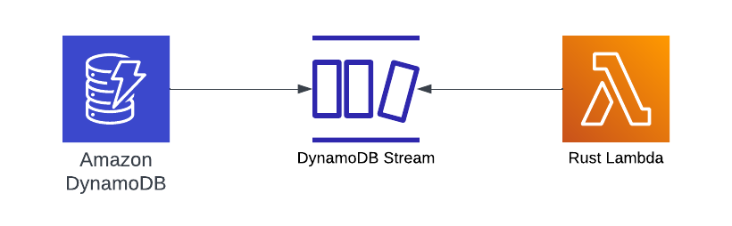

## DynamoDB Streams and Rust Lambda

Purpose: This repository demonstrates how to process DynamoDB Stream changes using Rust and Lambda.  It also supports this [article](https://www.binaryheap.com/dynamodb-streams-and-rust/)


### Deploy

```bash
cdk deploy
cd scripts

export DYNAMODB_ACCESS_KEY_ID=<your key>
export DYNAMODB_SECRET_ACCESS_KEY=<your secret>

node sample-data.js
```

### Destroy

```bash
cdk destroy
```